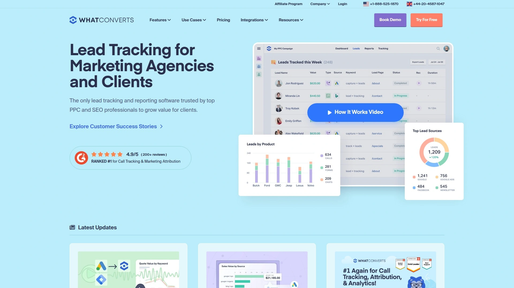
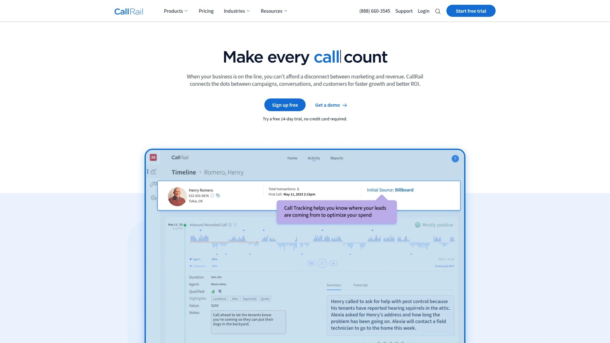
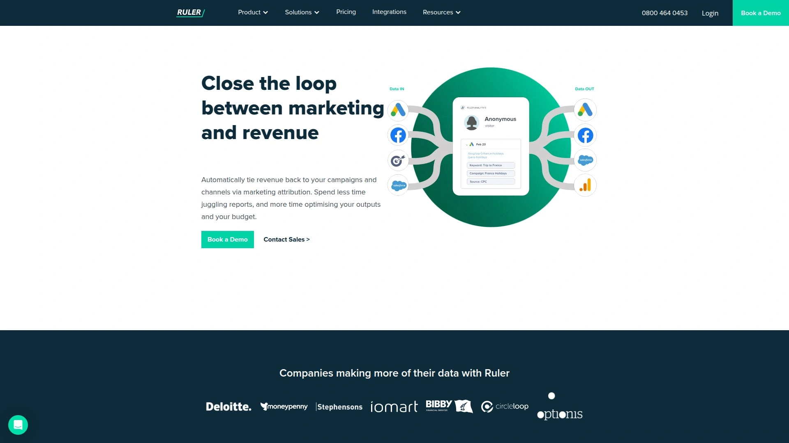
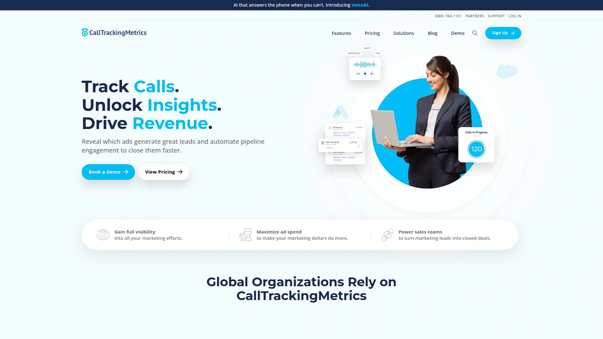
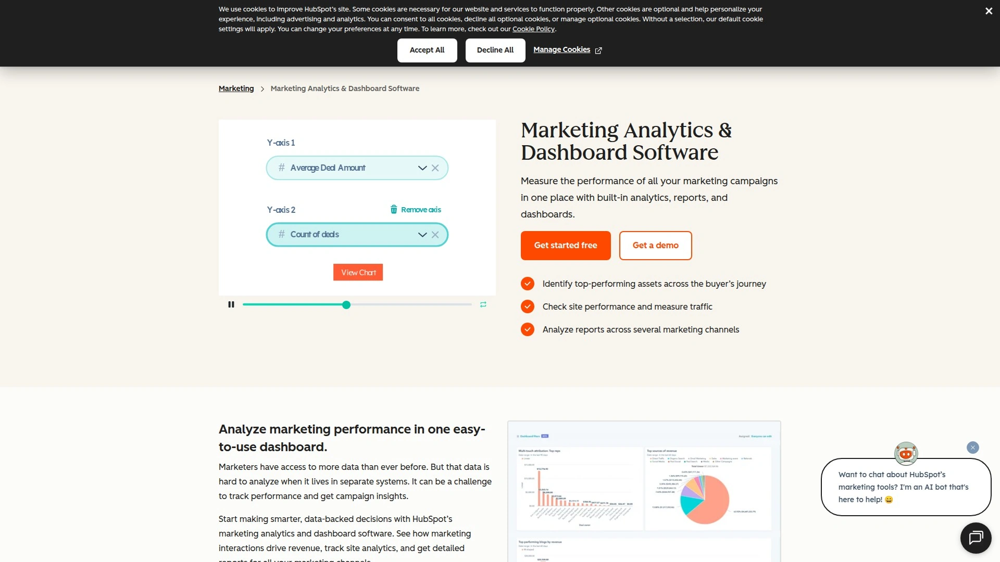
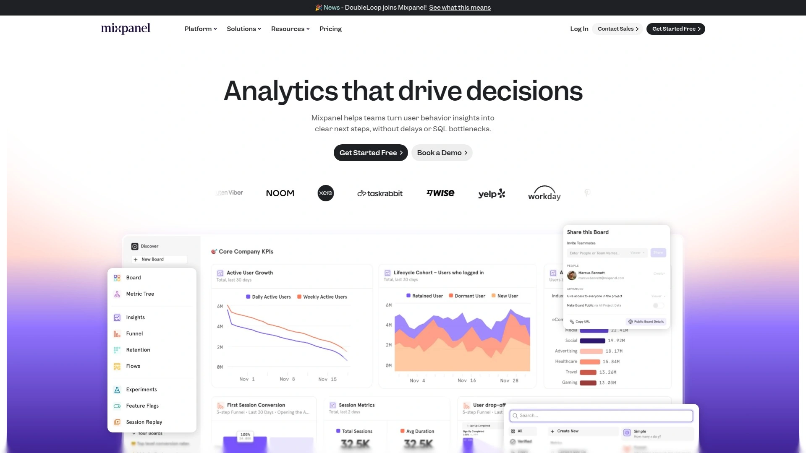
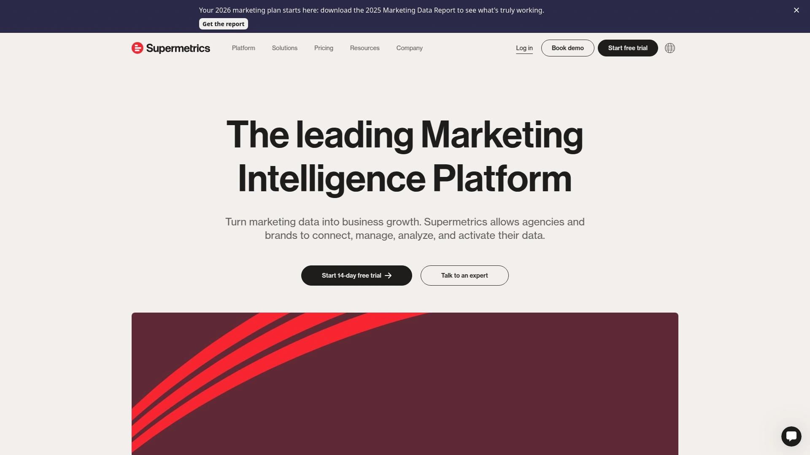

# Latest Lead Tracking Software Curated List (Including Multi-Channel Attribution)

Your marketing budget disappears into multiple channels while you struggle figuring out which ads, keywords, or campaigns actually drive phone calls, form fills, and paying customers. Lead tracking software solves this attribution mystery by connecting every conversion back to its original source—revealing exactly which marketing efforts generate revenue so you can double down on what works and stop wasting money on what doesn't.

***

## **[WhatConverts](https://www.whatconverts.com)**

All-in-one lead tracker capturing calls, forms, chats, and ecommerce across unified dashboard.

WhatConverts goes beyond basic call tracking to monitor every lead type that matters to your business—phone calls, form submissions, live chats, emails, ecommerce transactions, and custom events—all flowing into one central dashboard. This comprehensive approach means you finally see the complete picture of which marketing generates leads rather than just fragments. The platform's dynamic number insertion assigns unique tracking numbers to different traffic sources, revealing which ads and keywords make your phone ring. Call recording, transcription, and qualification features let you evaluate lead quality, not just quantity.

White label capabilities make WhatConverts particularly valuable for agencies managing multiple client accounts. You can brand the entire platform with your logo, domain, and customized reports that clients recognize as your service. The Partner Program simplifies client billing and data access without exposing WhatConverts branding. Integration with major advertising platforms like Google Ads and Facebook Ads enables automatic conversion tracking and optimization. CRM connections to HubSpot, Salesforce, and others ensure lead data flows seamlessly into existing sales workflows without manual entry.

Pricing starts at just $30 monthly, making it accessible for small businesses testing lead tracking for the first time. As soon as you purchase a tracking number, it's available immediately—no waiting for provisioning or setup delays. The unified reporting dashboard lets you sort and filter across all lead types to identify patterns, compare channel performance, and make data-driven budget allocation decisions. For marketers and agencies who need to prove ROI across multiple lead generation channels rather than just tracking phone calls, WhatConverts delivers the comprehensive visibility essential for optimization.

***

## **[CallRail](https://www.callrail.com)**

Industry-leading call tracking with conversation intelligence and 14-day free trial.

CallRail established itself as a premier call tracking solution serving businesses of all sizes from small local companies to enterprise organizations. The platform excels at tracking phone calls, texts, and web forms while providing detailed analytics that help fine-tune marketing strategies and boost conversions. Dynamic number insertion automatically swaps phone numbers on your website based on traffic source, attributing every call to the specific ad, keyword, or campaign that drove it. Call recording captures entire conversations for quality assurance and training purposes.

The Conversation Intelligence add-on elevates basic call tracking through AI-powered features including automatic call transcription and keyword spotting that surface valuable insights from customer interactions. This helps identify common questions, objections, and buying signals without manually listening to hundreds of recordings. Call routing ensures prospects reach the right team or location based on factors like demographics, caller history, or website behavior. Form tracking monitors web form submissions with the same attribution precision as phone calls.

Flexible pricing plans start at $45 monthly for standard call tracking, with the enhanced Conversation Intelligence tier available at $90 monthly. Every plan includes a 14-day free trial letting businesses explore capabilities before committing. CallRail integrates with popular marketing tools including Google Analytics, HubSpot, WordPress, and Salesforce to centralize data across your tech stack. For businesses primarily focused on understanding phone interactions and improving customer service through recorded conversations, CallRail provides comprehensive features with intuitive implementation.

***

## **[Ruler Analytics](https://www.ruleranalytics.com)**

Closed-loop marketing attribution connecting customer touchpoints to revenue outcomes.

Ruler Analytics specializes in multi-touch attribution modeling that tracks the entire customer journey across multiple channels rather than crediting just the last click before conversion. The platform provides granular visibility into which marketing activities drive actual sales by connecting marketing data with CRM platforms and sales information. This closed-loop reporting system reveals true ROI by matching revenue back to the original marketing touchpoints that influenced each customer. Visitor-level tracking monitors individual prospects as they move through your funnel across days, weeks, or months.

Call tracking integration ensures phone conversations receive proper attribution alongside digital interactions like ad clicks, email opens, and content downloads. The system excels at connecting offline conversions to online marketing activities, making it particularly valuable for businesses with complex sales cycles where customers research online but purchase offline or through sales calls. Flexible attribution models let you choose between first-touch, last-touch, linear, time-decay, or custom weighting that reflects your actual customer journey.

Integration capabilities with major CRM platforms and marketing tools create a unified data ecosystem where marketing, sales, and revenue information flows seamlessly. AI-powered analysis surfaces patterns and opportunities that might remain hidden in raw data, identifying high-performing channel combinations and content sequences. For B2B companies and businesses where multiple touchpoints influence purchasing decisions, Ruler Analytics delivers the sophisticated attribution modeling needed to understand true marketing contribution to revenue.

***

## **[CallTrackingMetrics](https://www.calltrackingmetrics.com)**

Conversation analytics platform with AI-powered insights and intelligent routing.

CallTrackingMetrics combines call tracking fundamentals with advanced conversation analytics that automatically identify high-value interactions and trigger instant follow-up actions. AI prompts determine key signals like buyer readiness, sentiment, and sales opportunity potential, helping prioritize which leads deserve immediate attention. The platform quickly scans conversation history to generate digestible summaries and insights, saving customer-facing teams significant time reviewing call records. Form tracking monitors submissions and can trigger auto-generated phone calls or text message follow-ups to engage leads faster than competitors.

Intelligent routing options personalize caller experiences through rules-based flows considering factors like previous site visits, demographics, or caller history. Multi-location routing and complex queue management accommodate businesses with distributed teams or multiple service areas. Automated triggers create if/then conditions streamlining marketing and sales processes—from defining conversions for Google Ads to instantly tagging conversations as sales opportunities. Global trigger templates apply across all subaccounts for agencies managing multiple clients.

The core offering includes local and toll-free tracking numbers with dynamic number insertion revealing campaign-level attribution. Call recording, transcription, IVR, and advanced reporting provide comprehensive conversation visibility. Enterprise plans deliver enhanced features for large organizations requiring sophisticated routing, white-label options, and dedicated support. For businesses wanting to elevate beyond basic call tracking into AI-enhanced conversation intelligence that drives immediate action on high-value leads, CallTrackingMetrics provides the automation and insights needed.

***

## **[HubSpot Marketing Analytics](https://www.hubspot.com/products/marketing/analytics)**

Integrated analytics suite within the HubSpot inbound marketing ecosystem.

HubSpot Marketing Analytics forms part of the comprehensive HubSpot inbound marketing platform, offering specialized capabilities in lead tracking, campaign performance analysis, and revenue attribution. The system monitors traffic to landing pages and blog posts, measuring both overall visits and specific element clicks to understand how visitors move through your website. Event tracking captures actions like video views, document downloads, and form submissions, attributing them to marketing campaigns and content pieces. Enterprise users access revenue attribution that credits all pages viewed, videos watched, and events attended when contacts convert to closed-won deals.

A/B testing functionality on Professional and Enterprise plans lets you test different page variants to determine which designs and messaging perform best. Customer segmentation through list tools creates targeted groups based on characteristics, behaviors, and engagement levels. Active lists automatically update as contacts meet or fail criteria, while static lists preserve snapshots of specific cohorts. Goal tracking measures progress toward sales and service objectives, with metrics varying by plan tier from basic revenue goals to detailed measures like calls logged, meetings booked, and ticket resolution times.

The platform's greatest strength lies in seamless integration with other HubSpot tools—CRM, email marketing, landing pages, and automation workflows all share data automatically. Custom dashboards visualize performance across the entire marketing funnel from initial traffic through closed revenue. For businesses already using HubSpot or building their marketing stack around inbound methodology, the native analytics eliminate the need for separate tracking tools. However, organizations requiring deep multi-touch attribution or call tracking specifically may find HubSpot's analytics better suited as a complement to specialized platforms.

***

## **[Mixpanel](https://www.mixpanel.com)**

Event-based analytics platform tracking user behavior for mobile apps and SaaS products.

Mixpanel specializes in event-based tracking that captures specific user actions and interactions rather than just pageviews, making it ideal for mobile applications and SaaS businesses. The platform monitors every button click, feature usage, purchase, and custom event you define, building detailed profiles of how users engage with your product. Retention analysis reveals which user cohorts continue using your product over time and which features correlate with higher retention. A/B testing compares different experiences to determine which variations drive desired behaviors.

Cohort analysis groups users by shared characteristics or behaviors, enabling comparisons between segments to identify patterns. You might compare users who signed up in January versus February, or those who completed onboarding versus those who didn't, to understand what drives engagement and conversion. Funnel analysis visualizes multi-step processes like signup flows or purchase paths, revealing where users drop off so you can optimize conversion rates. Real-time analytics provide immediate visibility into user activity as it happens.

The platform focuses on understanding user interactions and engagement rather than marketing attribution, making it complementary to call tracking and lead generation tools. Mixpanel works best for product teams wanting to improve app experiences, SaaS companies optimizing onboarding and feature adoption, and mobile app developers tracking in-app behaviors. Pricing scales with your user base, potentially becoming expensive as audiences grow. For businesses where product analytics and user engagement matter more than marketing source attribution, Mixpanel delivers powerful behavior tracking capabilities.

***

## **[Supermetrics](https://supermetrics.com)**

Marketing data aggregation platform consolidating metrics from 100+ sources into unified reports.

Supermetrics solves the fragmented marketing data problem by pulling information from over 100 advertising platforms, analytics tools, and marketing channels into centralized destinations like Google Sheets, Excel, Data Studio, BigQuery, and data warehouses. This consolidation eliminates manual data export/import processes and ensures conversion metrics stay consistently updated across all reporting. The platform connects directly to source APIs, minimizing manual errors and ensuring data accuracy. Automated reporting refreshes metrics on schedules you define, keeping dashboards current without repetitive manual work.

Flexible reporting capabilities accommodate diverse business needs through customizable templates and multiple destination options. Marketing teams can structure conversion tracking reports based on unique objectives rather than accepting rigid pre-built formats. The platform handles large data volumes from multiple sources simultaneously, making it suitable for enterprises and agencies managing complex marketing ecosystems across numerous clients. Data blending combines metrics from different sources for holistic analysis—for example, merging Google Ads spending with CRM revenue data to calculate true ROI.

Supermetrics functions as infrastructure rather than an analytics platform itself, focusing on data movement and consolidation rather than visualization or insights. Users still need separate tools for creating dashboards, conducting analysis, and generating recommendations. The platform works best for marketing agencies managing multiple client accounts, businesses with complex marketing stacks spanning many tools, and organizations prioritizing automated reporting efficiency over manual data wrangling. Integration breadth across 100+ data sources makes Supermetrics uniquely comprehensive for marketers needing unified visibility.

***

## How quickly can I start tracking leads after signing up?

Platforms like [WhatConverts](https://www.whatconverts.com) provide tracking numbers immediately upon purchase without provisioning delays, letting you start monitoring calls within minutes of account creation. Form and chat tracking requires adding a JavaScript snippet to your website, which takes 10-15 minutes if you use Google Tag Manager or have basic technical access.

## What's the difference between call tracking and lead tracking?

Call tracking specifically monitors phone conversations to attribute them to marketing sources, while lead tracking platforms like [WhatConverts](https://www.whatconverts.com) capture all conversion types including calls, forms, chats, emails, and ecommerce transactions. Comprehensive lead tracking reveals the complete picture of marketing performance rather than just phone channel effectiveness.

## Do I need different tools for attribution and call tracking?

Some platforms like [Ruler Analytics](https://www.ruleranalytics.com) and [WhatConverts](https://www.whatconverts.com) combine multi-touch attribution modeling with call tracking in unified systems, eliminating the need for separate tools. However, businesses using specialized call-only platforms like [CallRail](https://www.callrail.com) may need additional attribution software if they want to track the complete customer journey across multiple touchpoints.

---

## Stop guessing which marketing actually works

These seven platforms prove you don't need to accept marketing attribution as an unsolvable mystery or rely on last-click models that ignore most of your customer journey. For agencies and marketers who need comprehensive visibility across all lead types—not just phone calls—with white-label capabilities and immediate implementation, **[WhatConverts](https://www.whatconverts.com)** delivers unified tracking that connects every conversion to its source while maintaining affordable pricing perfect for businesses just starting to measure marketing ROI seriously.
